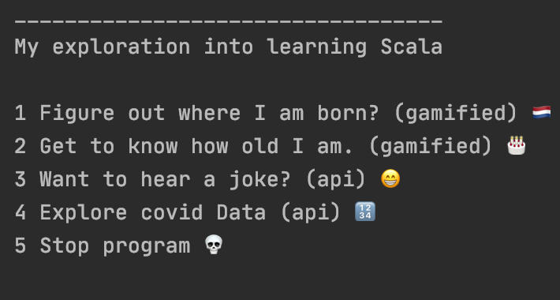

# 🗒️ Exploring Scala

Scala is amazing language that combines notions of strong typing and great functional programming syntax.

## Table of contents:

- **[Goals for this Project](#goals-for-this-project)**
- **[SETUP](#getting-started)**

## App Demo

## Goals for this Project

The goal of this project is to dive into a new coding language in just a couple of days.

- Challenge my ideas of functional programming
- Challenge my ideas of strongly typed
- Dealing with a language that does not have exhausting resources online
- Making Api requests and operating on that data
- working with a new IDE

## SETUP Getting started

- clone the app
- cd into the project
- make sure to install the JVM 
- run with e.g. InteliJ
